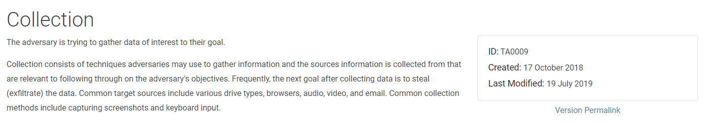

# Navigating the Att\&ck Matrix - Collection

Then you have collection. Collection is when they discover information on a system, or get credential access, other methods, and they zip that data up and exfiltrate it out the organization.&#x20;

You have different techniques that are performed here, even audio capture, especially if they are able to get access to a system of a executive or someone that has really privileged information. They can enable the audio of the microphone on the system, and then capture what's being discussed. Clipboard data is another interesting one. You copy things to your clipboard, you don't empty it, then that information could be exfiltrated. This can be used to collect things such as passwords. Here are other techniques, and sub techniques.&#x20;

