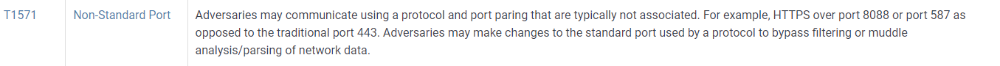

# Navigating the Att\&ck Matrix - Command and Control

Command and Control. This is a system that exists outside of the organization that is compromised. The system is used to send commands and perform actions within the organization that they've compromised. So you have a host that has malware on it. The malware is just going to sit there and sleep for a period of time. After a certain period of time it is going to communicate out to the command control server and determine if some action needs to be performed. Maybe it's going to give them a command prompt or download a new version of the malware that they use. Attackers are (or can be) in systems for so long, that they upgrade their their malicious code. Then they upgrade it on the compromised system as well, because it has new techniques and things that it carries out on the system.&#x20;

Here are the various techniques that are used for command and control.&#x20;

This includes a non-standard port. This means that they're going to use a port that's abnormal. For example, web is HTTPS - this is port 443. But they may use port 777, for example, that stands out. It's a little noisy, but it depends on the organization. Are they looking for nostalgia ports being used on on the network? &#x20;

