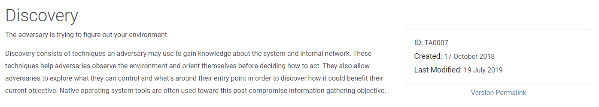

# Navigating the Att\&ck Matrix - Discovery

Discovery is when the threat actors begin to enumerate or 'discover' information about the host that was compromised or the network where the host resides. Information such as running processes and services, user/group accounts, domain information, etc.  All of it can be used for a variety of purposes.  The threat actor can harvest credentials and gain access to multiple accounts that were discovered to maintain persistence or gain access to data that allows them to achieve their goal.  Software that is installed can be used to determine if vulenrabilties could allow obtaining privileged access to a compromised host..&#x20;

Every process in one of these tactics here depends on the attack group. Not all are going to perform the same actions so discovery may have different purposes. Here are the techniques that they use for discovery.&#x20;

