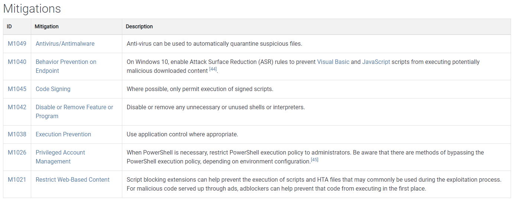

# Navigating the Att\&ck Matrix - Execution

Now once you get initial access, the next thing that is going to happen is some type of execution of code. You download the attachment, you double click on it, and it's going to execute something on that system.&#x20;

Look at this command and scripted interpreter. This is a very common one that's, that's used. And here's a technique, command, a scripting interpreter, close some tabs here, so don't get lost. Right click. Once again, there's a definition, you always have the definition. And then notice all the sub techniques here, lots of sub techniques. These operating systems they apply to the required user permissions, the user does not have to be an admin. Because if you're able to execute code, PowerShell, command shell, etc. that can be the gateway into the organization. We'll talk about that in just a few minutes.

&#x20;Here are your data sources that you want to have insight into, in order to determine if command execution is occurring, or to help support after the fact investigations. Here are some threat groups that are known to use command and scripting interpreter techniques.&#x20;

Here are your mitigations.&#x20;

Here are your detections.&#x20;

Then more references, so it follows the same format. This is a well formatted document, it's light.&#x20;

Let's just look at one more here. This is PowerShell. This is one of the sub-techniques. Then see all the threat groups that use PowerShell. And it has software programs that are specifically designed to allow for more access into the organization.&#x20;

