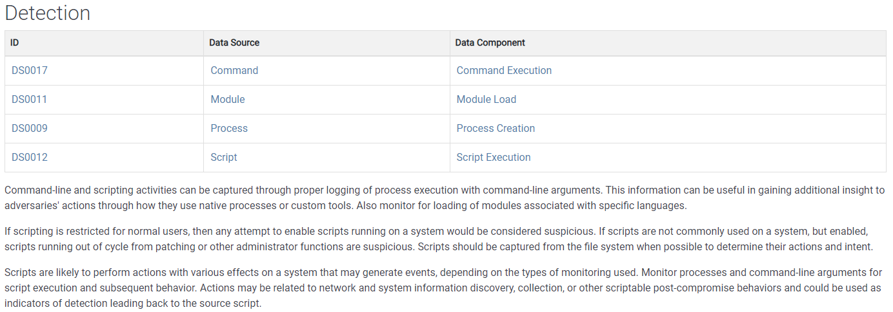
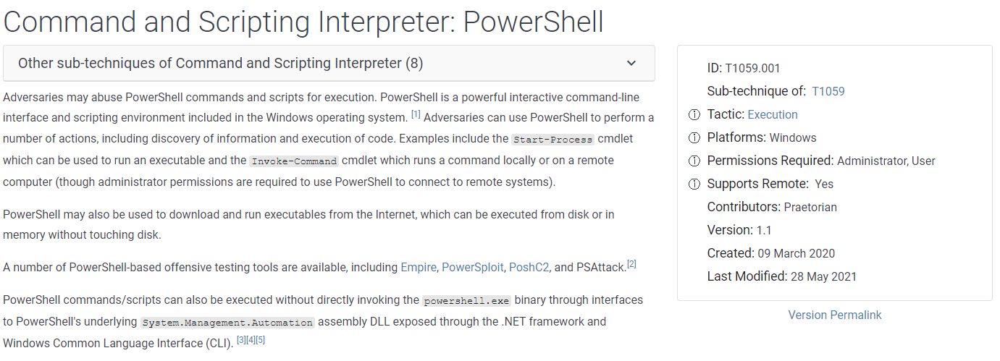

# Navigating the Att\&ck Matrix - Execution

Once the threat actors are in via their initial access point, the next goal is to execute code. That can be execution of a document that was downloaded with malicious payload, arbitrary command execution from a web application, etc.&#x20;

Command and scripted interpreter are very common Techniques used to execute code. Even though commands may be executed in context to the authenticated user, it is still problematic because a normal user can run commands to gather a lot of information about the network.  The user on the host that was compromised does not have to be an admin.  The threat actor could execute malware or scripts that could elevate to admin via local privilege escalation, for example. Effectively, the initial host that was compromised becomes a proxy or jumping off point for lateral movement throughout out the organization.

&#x20;Here are data sources that you want to have insight into, in order to determine if command execution is occurring, or to help support after the fact investigations. Here are some threat groups that are known to use command and scripting interpreter techniques.&#x20;

Here are mitigations.&#x20;

.PNG>)

Here are detections.&#x20;

Then more references about command execution.&#x20;

For Powershell, this is a sub-techniques. Then see all the threat groups that use PowerShell. The att&ck site also has software programs that are specifically designed to allow for more access into the organization.&#x20;

