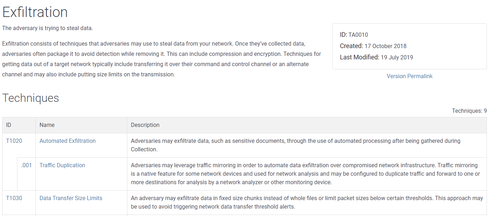

# Navigating the Att\&ck Matrix - Exfiltration

Exfiltration. This is the process where the threat actor steals data from the organization. These are the various techniques that are used in order to exfiltrate the data.  Some ransomware threat actors will use this method to prove to the organization they were in their systems and have the original unencrypted copies of their data.

