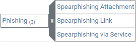
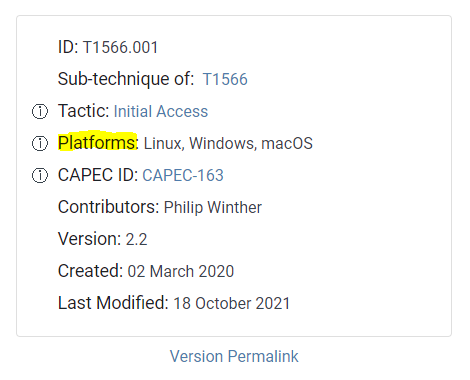
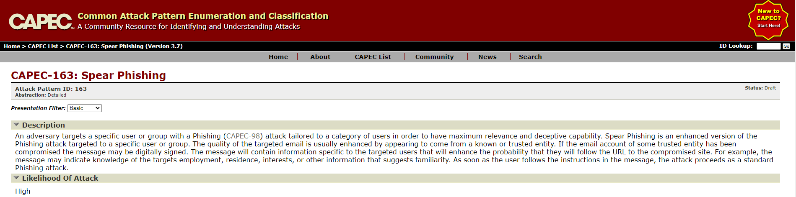
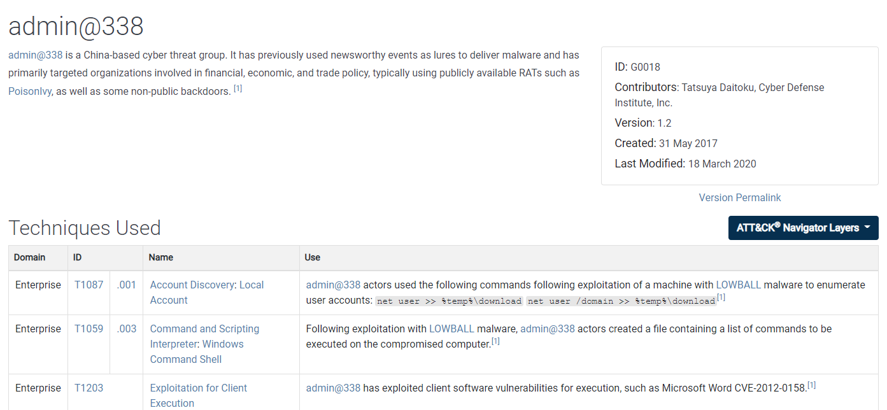
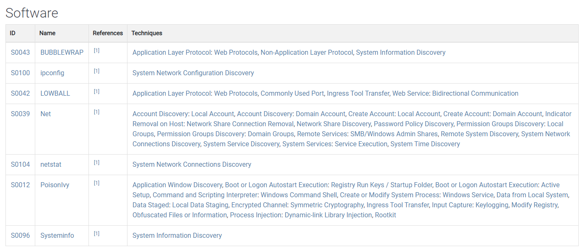
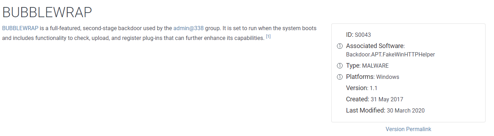
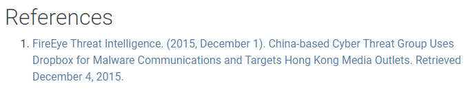
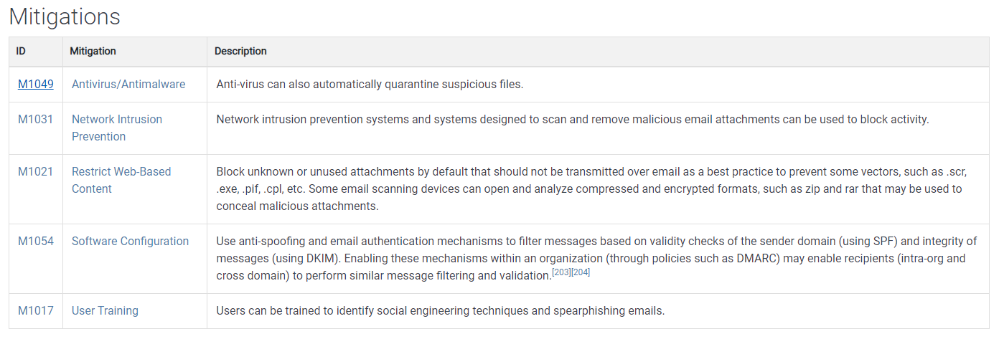
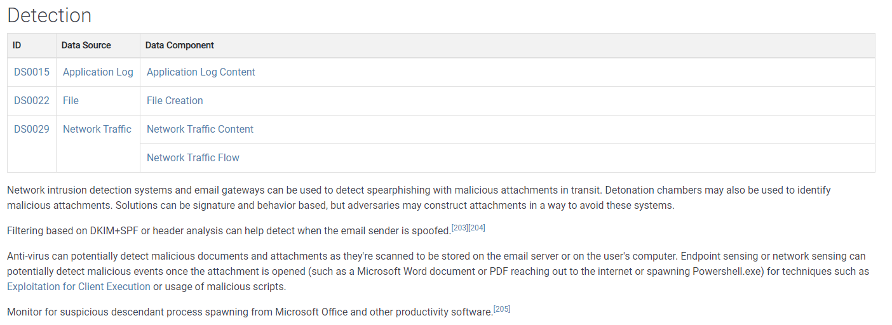
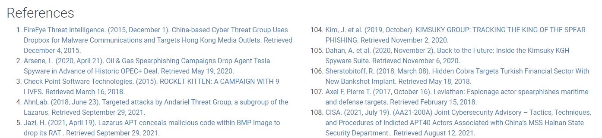

# Navigating the Att\&ck Matrix - Initial Access

Reconnaissance and Resource Development were added on later in the process of developing the Mitre Att\&ck framework. These help provide information on how adversaries start to carry out their operation.&#x20;  The goal is to gain access to carry out their mission. Initial access is critical. Initial access is the start of the campaign. This is where they're trying to get into your network. They do that via techniques such as drive-by compromise and phishing.

With phishing, you have the techniques below. If you open it up, it gives you a definition of phishing. Notice the sub-techniques. Click on ao sub-techinique like spear-phising attachment. Each sub-technique has its own ID. The tactic is initial access. This is the goal.&#x20;

These are the known platforms in which spear phishing works. THe reason it has Linux, Windows, and Mac OS is because those are the most common ones on the internet. Yes, there are other operating systems out there, but they're targeting these particularly because they have more information about these. What this means here is that the spear phishing attachment sub-technique applies to Linux, Windows, and Mac OS. To get more information about other operating systems, they're updated here.

Once again, this is invaluable for SOC analyst data sources. This is telling you how you can detect spear phishing attacks or attempts. If you have access to email messages, is content, and attachment, that's how you can monitor for spear phishing.  A web proxy also helps because it could block the malicious domain within the email if a user clicks on it.  Layered protected could mitigate the risk.&#x20;

And then this, CAPEC ID. If we open this in another tab, you'll see that it's the Common Attack Pattern Enumeration and Classification. Meaning this is a well known attack and this is a generic definition of what spearphishing is. So you can click on it to get more information.

Scroll down and you start to see procedure examples. Now what does this mean? What we're looking at are groups in a G right there, that means groups. This is a group that is known to use spearphishing. The group admin@338, has sent emails with malicious word Microsoft Office documents attached so they're telling you about this group's behavior to obtain initial access.&#x20;

Click on the group ID, and you'll get more information about that known threat group. This is again, one of the benefits of the att\&ck framework. It maps out the the TTPs, techniques, tactics and procedures for known threat groups. These are all the techniques that are used by this particular threat actor. They do a lot of different things on the system.&#x20;

This is a type of software they use. Just like with our tactics and techniques, each group has an ID. Then, attribution for who provided the information about the threat group and other metadata you see below.&#x20;

Same thing with software. This is BUBBLEWRAP. You can see this is a backdoor. It has its own ID. The type is malware, and the platform it impacts is windows. Now you know that you can look at Windows platforms for the software BUBBLEWRAP if the threat actor targets organizations withint your particular industry.&#x20;

Alright, here's some of the techniques that are used for BUBBLEWRAP, as you see right here. You can see groups that use the software.

Here are the techniques that are used by BUBBLEWRAP. It can communicate using SOCKS, T1095. It can communicate using HTTP or HTTPS, T1071. You see how it works. You could get caught up in a almost like a Google search. You look for one thing, and you end up to minutes later at something that you didn't even intend to go to. You want to be sure that you rein it in a little bit, and not get too caught up into all the links that you have here.&#x20;

At the very bottom, you also find references to get more information about the adversary. So essentially, Mitre gives you the high level overview or the metadata. Then, you can click on this reference link and read more information that's provided by FireEye. Okay, so this is a threat group.&#x20;

Let's go back to the sub-technique of spear phishing. Again, read information about it. Procedures, all the groups, etc. You can see between some groups in the procedure examples is some software. Other groups use this because it's highly effective. If an organization doesn't have a public presence, meaning their web servers, mail servers and all other services are hosted out in the cloud, then the adversaries are going to use other techniques to get inside the organization. Spearphishing is the most effective. You send it to the right number of people or the right people to open an attachment or click a link, and it could impact the entire organization.&#x20;

There are mitigations to all of the techniques. Sub-techniques are going to have mitigation documented. You can see here these are some mitigations to put in place to help minimize the impact of spearphishing.&#x20;

The detections listed in the att&ck framework are great resource for SOC analyst. They can see if they have the proper insights and are obtaining the proper logs in order to provide a more comprehensive insight into the organization. Detections are going to help you identify when an attack is imminent, or about to occur, or attempt to occur. Your antivirus may prevent someone from opening a malicious document. In that case, you're going to get a virus alert, an antivirus alert. Then you can take action based on it.&#x20;

You can see there's a lot of information and references about this because spearphishing is a very, very common technique used by threat actors. Red teams, the good 'ackers will tell you that this is one of their last resorts. If they can't get in otherwise, this is almost always going to work. Not always, but almost always.&#x20;

