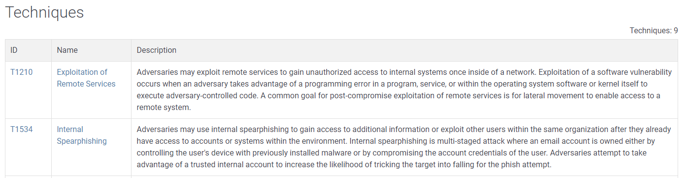

# Navigating the Att\&ck Matrix - Lateral Movement

Lateral movement is when threat actors access other systems in the organization from the initial access point. That's what makes incident response and cleanup very difficult. It is important to understand the behavior of the adversaries and what their tools are first. Then security personnel can use incident response tools and techniques to detect them on other systems to properly contain the incident.&#x20;

If there are 100 systems, the attackers will probably compromise about 10 of those just to maintain the access they want. It's not likely that they are going to compromise all 100 systems. Once more hosts are compromised, the malware is likely going to be inactive (sleeping) until a given period of time.  The malware will then wake up and beacon out to the command and control (C2 or C&C) server for instruction. This lateral movement is when a compromise becomes a nightmare to manage. Below are some TTPs that are used to achieve the goal of lateral movement.&#x20;

