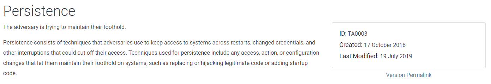

# Navigating the Att\&ck Matrix - Persistence

The next thing that may happen, depending on the goal of the adversary, is persistence. Persistence is where they're trying to maintain access inside of the network. This is important because the adversaries goal may be to find documents. Once they find documents, they may jump over to exfiltration.  They may harvest credentials and persist or wait and capture email messages and documents and keep track of what the organization is planning, steal intellectual property, etc.

Persistence, they're going to try to either determine if the current user is an admin. If they are, that's great. It makes persistence a lot easier (and lateral movement). That means they can run their malicious code, and maybe add a job into the test scheduler that runs periodically, and gives them a command shell remotely, if needed. What you're looking at here are the various techniques and sub-techniques that are used to maintain persistence. Be sure you take a look through all scheduled tasks. This is a big one. As security admins, you want to be sure that you keep an eye on any new or removed scheduled tasks on all your systems.&#x20;

