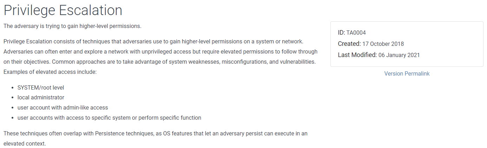

# Navigating the Att\&ck Matrix - Privilege Escalation

If a threat actor attacks a system and the current user is not an admin, what they're going to start doing is trying to escalate their privileges. By escalating their privileges to an admin or poweruser, they're able to better maintain persistence or get access to sensitive information. Below are some techniques for privilege escalation.&#x20;

They're going to go through a series of steps. One is checking to see if the current user has admin privileges by examining the group they are in.  It creates less noise than trying to download and run an exploit. However, they may look for host-based vulnerabilities, or they may see that a normal user has access to a script that gets started after a reboot and then inject commands to elevate privileges. If a script starts during a reboot, it's likely being started with admin privileges - depending on the order and permissions given to the script. They're going to scan a system to look for the software installed and see if there's any vulnerable software that they can use to exploit, to then escalate privileges. Below are some TTPs they may use.

