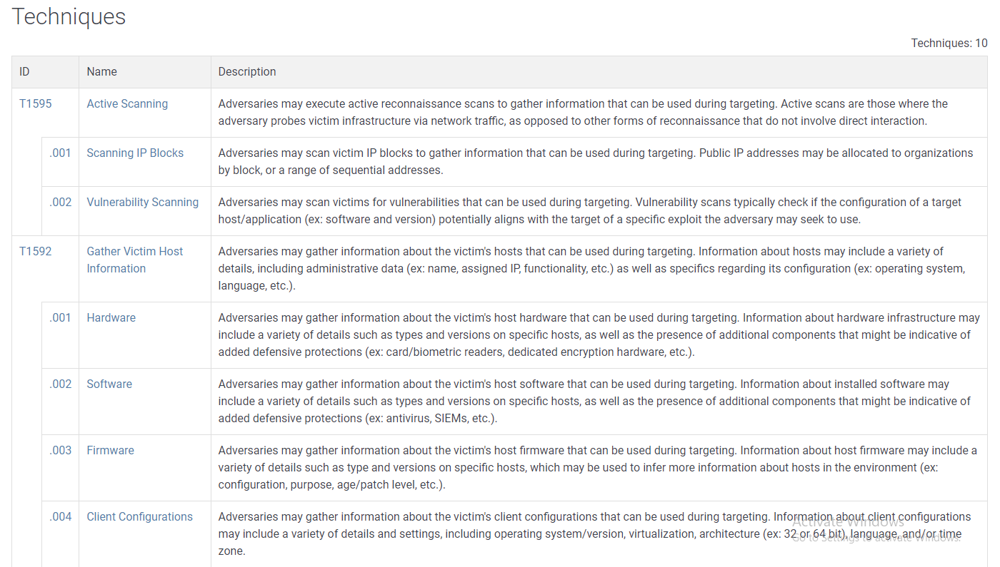
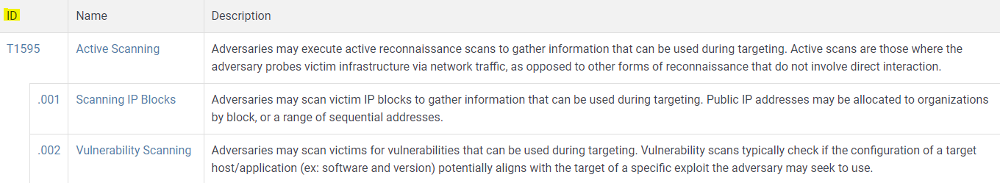
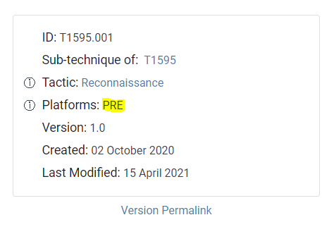
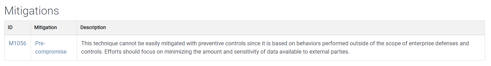
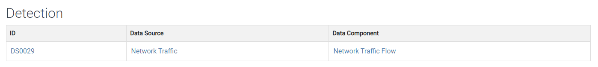

# Navigating the Att\&ck Matrix - Reconnaissance&#x20;

&#x20;Let's look at what each one of these are. In the process, we'll start to navigate the attack framework.&#x20;

So I talked about reconnaissance here, and I'm just going to right click on this, and open the link in a new tab. Whenever you do that, you're taken to a page which gives you a definition of what reconnaissance means. You always have access to this. This is where they're gathering information  to prepare and carry out their goal.

As we scroll down here, we now get into the techniques. So you have the tactics, and now you have the techniques.&#x20;

The techniques here are active scanning, scanning IP blocks, vulnerability scanning, etc. This is where they are using tools, like software tools, or they are using things like Google to find out as much information as they can about their target. If they get enough information, it is very likely that the attack will succeed. With every single technique, you have a description of what it means. Then you have more links. You have a lot of links here to other things, this can go deep, deep, deep into the behaviors of the adversary. But you don't want to get caught in a in a loop, or a diverge too far from what you're trying to try to understand and document about the adversary. These are all the techniques.&#x20;

Every tactic has an ID. If you're writing a report, and you start to determine how they were able to perform reconnaissance, then you'd put this ID next to it. We'll talk about this more later on. This is the same thing with techniques, each technique has an ID.&#x20;

As you see right here, T1595 is a technique for active scanning. Now each technique can have sub techniques. With active scanning, a sub technique is scanning IP blocks. The ID for that is T159 5.001. If I click on this, you can see how it gives a definition of what skinny IP blocks means. And then on the right hand side, we have more information. Once again, each tactic, technique, and sub-technique has an ID. Active scanning is a sub-technique of T1595. The tactic is reconnaissance.

Now, this PRE. When this framework first came out, these were not that popular. So people typically don't, don't map these. If they know how they were performing reconnaissance and if they know how they were performing resource development, you'll sometimes see it documented. But it's okay to leave these two out when you're mapping the attack, which we'll talk about in the next video.&#x20;

Now, data source. This is where the attack framework has real power here. Now we get into more than just "this is reconnaissance". This is how they perform reconnaissance. This is the technique where we get into how do you actually detect it. And if you have these data sources, network traffic, network flow traffic, that's how you're able to detect active scanning. There are many ways you can you can do that. For example, an IP address hitting multiple ports in rapid succession over a long period of time or a short period of time. For SOC analysts, this part is really, really important, because they can determine if they have these capabilities of monitoring within the organization. Network traffic flows can tell you a lot of information. You got the version when it was created, it was last modified, etc.

Now more benefits to this attack framework. Here they show you mitigations. How do you mitigate active scanning? You can see, it's hard to to mitigate this, because if you have a public presence anybody on the internet can scan you. It's really not illegal, as long as it doesn't cause any types of denial of service attacks, and things of that nature. There's not much you can do about echo scanning. But you can detect it. It's all part of the process.&#x20;

If you do have a compromised network, you go back to your logs and you can see if the IP addresses have been on your network before. In this case, if they were scanning from the same IP address and attacking from the same IP, then you can see that they were scoping the organization  ahead of time.&#x20;

With every technique, you're going to have information or metadata about the technique, the ID, the sub-technique, if it's a sub technique of a major technique, the tactic, and then platforms. We'll see other examples of what this means here.&#x20;

