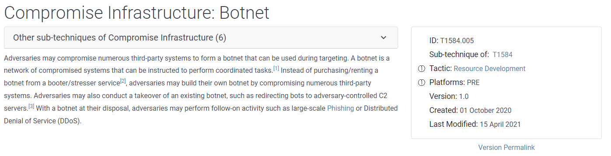

# Navigating the Att\&ck Matrix - Resource Development

When the threat actor has enough information, the move to Resource Development where they developing methods in which they can use to carry out their attack. As you can see, during the reconnaissance phase they can find compromised accounts, for example or what they found made them able to determine access to email accounts. Maybe there was a password file out on the public web server or they're able to compromise the infrastructure using other information that was found.

&#x20;Botnet, what does this mean? "Adversaries may compromise numerous third-party systems to form a botnet that can be used during targeting". You have to get a lot of systems if you really want to be a really effective botnet. Then they can be used to cause a distributed denial of service. All those bots connect to a remote system at one time, sending a little bit of data. If you have hundreds of thousands of those doing that at one time, then you can really put pressure on the network resources on the system.

