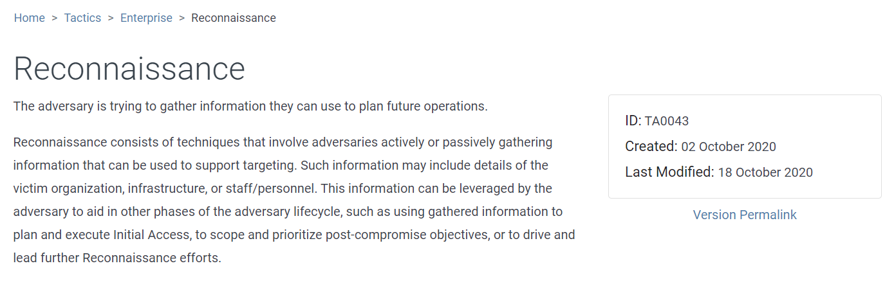

# Navigating the Att\&ck Matrix

&#x20;Let's look at what each one of these are. In the process, we'll start to navigate the attack framework.&#x20;

So I talked about reconnaissance here, and I'm just going to right click on this, and open the link in a new tab. Whenever you do that, you're taken to a page which gives you a definition of what reconnaissance means. You always have access to this. This is where they're gathering information  to prepare and carry out their goal.

As we scroll down here, we now get into the techniques. So you have the tactics, and now you have the techniques.&#x20;

The techniques here are active scanning, scanning IP blocks, vulnerability, scanning, etc. This is where they are using tools, like software tools, are they using things like Google to find out as much information as they can about their target. And if they get enough information is very likely that the attack will succeed. And with every single tech technique, you have a description of what it means. And then you have more links. So you have a lot of links here to other things, this might can go deep, deep, deep, deep into the behaviors of the adversary. But you don't want to get caught in a in a loop or a, you know, diverse to far from what you're trying to try to understand a document about the adversary. So these are all the techniques. And then every tactic has an ID. So this is the ID. If you're writing a report, and you start to determine how they were able to perform reconnaissance, then you'd put this ID next to it, which we'll talk about more later on. And the same thing with techniques, each technique has an ID, as you see right here, t 1595 is a technique for active scanning. Now each technique can have sub techniques. So with active scanning, a sub technique is scanning IP blocks. And so the ID for that is T 159 5.001. So if I click on this, you can see how it gives a definition of what skinny IP blocks means. And then on the right hand side, we have more information. Once again, each tactic each technique, a sub technique has an ID. Okay, and is a sub technique of active scanning t 1595. The tactic is reconnaissance. Now, this PRT, when this framework first came out, these two were not that popular. So people typically don't, don't map these USBs discussed, if they know how they were performing reconnaissance, if they know how they were able to develop their resource, performing resource development, you'll sometimes see it documented. But it's it's okay to leave these two out when you're mapping the attack, which we'll talk about in the next video. So I lost my train of thought, what's going to happen often? Oh, yeah, pretty fast talking about pre there. And then data source smell. This is where the attack framework has real power here. Now we get into more than just, this is reconnaissance. This is how they perform reconnaissance. This is the technique we get into how do you actually detect it. And if you have these data sources, network traffic, network flow traffic, that's how you're able to detect active scanning. And there are many ways you can you can do that, for example, an IP address hidden multiple ports in rapid succession over a period of time, or a short period of time. So you're if a sock analysts, this part is really, really important, because they can determine if they have these capabilities of monitoring within the organization. And network traffic flows can tell you a lot of information. You got the version when it was created, it was last modified, etc.
