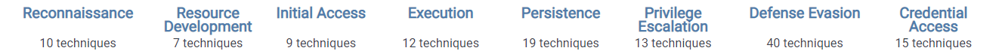

# Tactics

Let's look at this. With the attack framework, it is mapping out the tactics, techniques and procedures. The tactics are the top headers. Tactics are the goals of the adversary. These are the goals to perform, recognizance, and develop resources.&#x20;

Once they find enough information about the organization during the reconnaissance phase, then they're gonna start developing resources in order to begin the process of carrying out the attack. To gather information they analyze it to recon, and now they're gonna start figuring out - what is the plan of action to gain initial access into the organization? Initial access, this is the goal. Then they can start carrying out the remainder of their mission. So along the top of the matrix, these are the goals that are trying to achieve. These are all the tactics.
